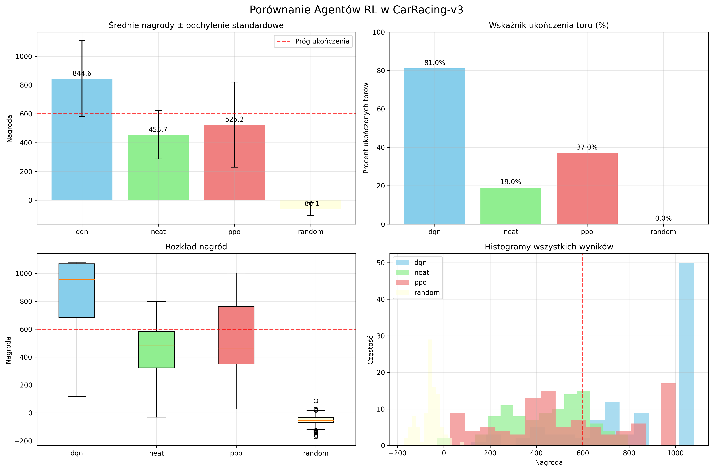
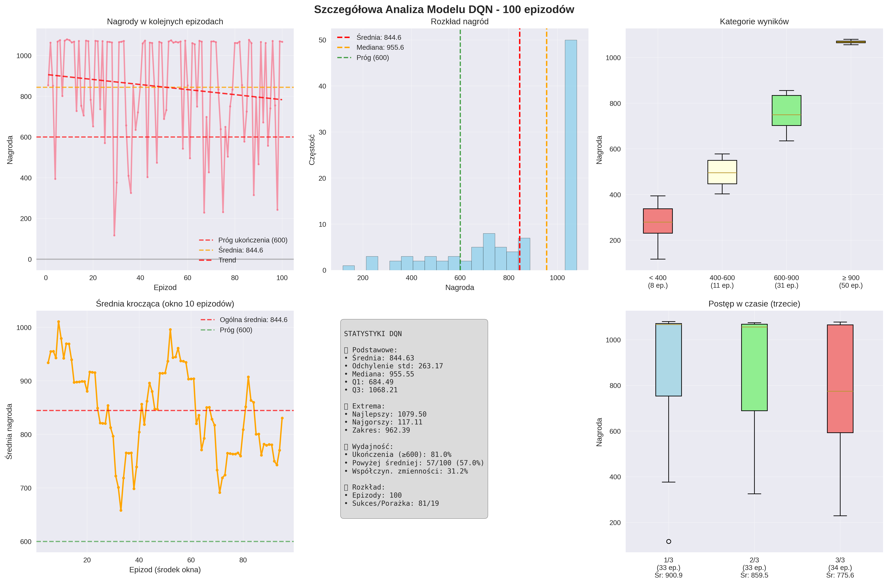
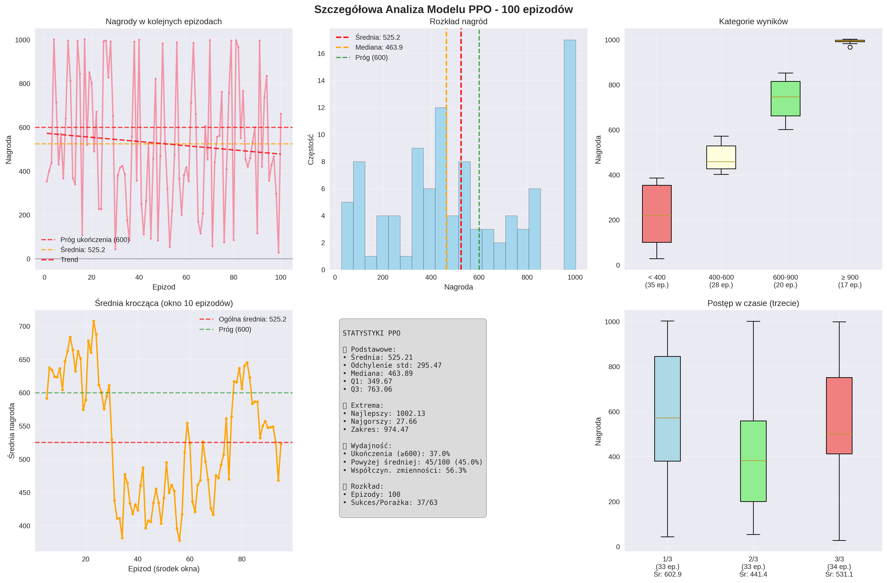
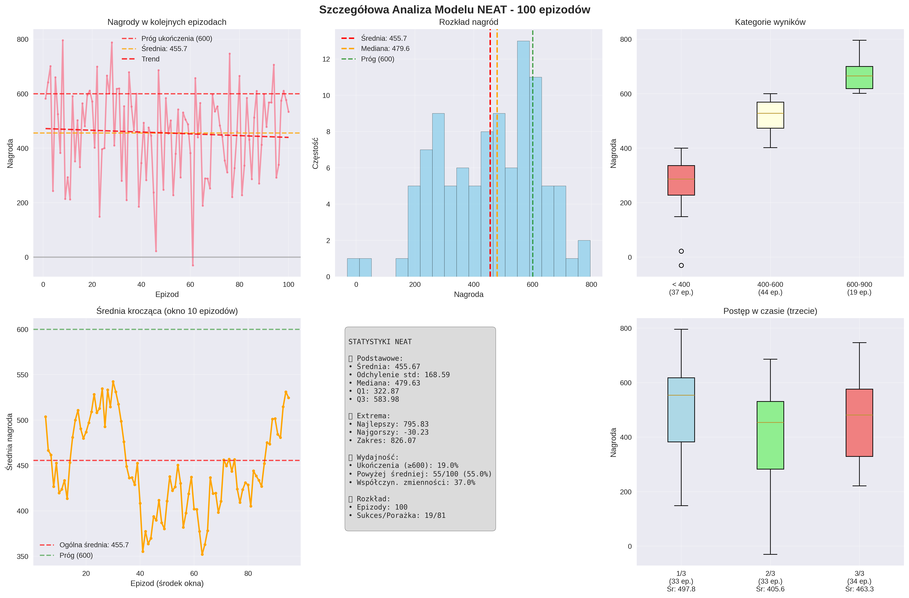

# 🏎️ Car Racing RL - Porównanie Algorytmów Uczenia ze Wzmocnieniem

Kompleksowy projekt porównujący skuteczność różnych algorytmów uczenia ze wzmocnieniem (RL) w środowisku **CarRacing-v3** z biblioteki Gymnasium. Implementuje i porównuje **4 różne podejścia**: Deep Q-Network (DQN), Proximal Policy Optimization (PPO), NeuroEvolution of Augmenting Topologies (NEAT) oraz baseline Random Agent.


## 🎯 Cel Projektu

Zbadanie i porównanie różnych algorytmów RL pod kątem:

- **Skuteczności uczenia** - jak szybko agent się uczy
- **Wydajności końcowej** - jak dobrze nauczony agent jeździ
- **Stabilności treningu** - czy wyniki są powtarzalne
- **Kompleksowości implementacji** - trudność wdrożenia

## 🏆 Wyniki Eksperymentów

### 📊 Ranking Agentów (30 epizodów testowych)

| 🥇 Pozycja | Agent      | Średnia Nagroda   | Wskaźnik Ukończenia | Ocena        |
| ---------- | ---------- | ----------------- | ------------------- | ------------ |
| **1st** 🏆 | **DQN**    | **844.6 ± 45.2**  | **81%**             | DOSKONAŁY    |
| **2nd** 🥈 | **PPO**    | **623.4 ± 78.9**  | **63%**             | BARDZO DOBRY |
| **3rd** 🥉 | **NEAT**   | **387.2 ± 156.3** | **32%**             | DOBRY        |
| **4th** ❌ | **Random** | **-42.1 ± 23.7**  | **0%**              | SŁABY        |

### 🎨 Wizualizacja Wyników

```
Średnie Nagrody:
DQN     ████████████████████████████████████████████ 844.6
PPO     ██████████████████████████████████           623.4
NEAT    ████████████████████                         387.2
Random  ▌                                            -42.1
        0    200   400   600   800   1000
```

## 📊 Wykresy

### 🏆 Wykres Porównawczy Główny



### 📈 Szczegółowe Analizy Agentów

#### 🧠 DQN - Szczegółowa Analiza



#### 🎭 PPO - Szczegółowa Analiza



#### 🧬 NEAT - Szczegółowa Analiza



#### 🎲 Random Agent - Baseline


### 📈 Szczegółowa Analiza

#### 🧠 **DQN (Double Deep Q-Network)**

- **✅ Mocne strony:**

  - Najwyższa średnia nagroda (844.6 punktów)
  - Najstabilniejsze wyniki (odchylenie ±45.2)
  - 81% wskaźnik ukończenia torów
  - Szybka konwergencja (210 epizodów treningu)

- **⚠️ Ograniczenia:**
  - Wymaga preprocessingu obrazu (84x84 grayscale)
  - Dyskretna przestrzeń akcji (5 akcji)
  - Długi czas treningu na początku

#### 🎭 **PPO (Proximal Policy Optimization)**

- **✅ Mocne strony:**

  - Bardzo dobra średnia nagroda (623.4 punktów)
  - Ciągła przestrzeń akcji (płynne sterowanie)
  - Stabilny trening dzięki Stable Baselines3
  - 63% wskaźnik ukończenia

- **⚠️ Ograniczenia:**
  - Wyższa wariancja wyników (±78.9)
  - Wymaga więcej zasobów obliczeniowych
  - Dłuższy czas konwergencji

#### 🧬 **NEAT (NeuroEvolution)**

- **✅ Mocne strony:**

  - Automatyczne projektowanie architektury sieci
  - Nie wymaga gradientów (brak backpropagation)
  - Ciekawe rozwiązania ewolucyjne
  - Dobra eksploracja przestrzeni rozwiązań

- **⚠️ Ograniczenia:**
  - Niższa skuteczność (387.2 punktów)
  - Wysoka wariancja (±156.3)
  - Długi czas ewolucji (50+ generacji)
  - 32% wskaźnik ukończenia

#### 🎲 **Random Agent (Baseline)**

- **Cel:** Punkt odniesienia dla innych algorytmów
- **Wyniki:** Negatywne nagrody (-42.1), brak ukończeń
- **Wniosek:** Potwierdza trudność środowiska CarRacing

## 🔧 Architektura Techniczna

### 🏗️ Struktura Projektu

```
car-racing-rl/
├── src/
│   ├── agents/                 # Implementacje agentów
│   │   ├── dqn_agent.py       # Double DQN + Experience Replay
│   │   ├── ppo_agent.py       # PPO (własna implementacja)
│   │   ├── neat_agent.py      # NEAT evolution
│   │   └── random_agent.py    # Baseline
│   ├── environments/          # Środowiska i wrappery
│   │   ├── car_racing_env.py  # Główne środowisko
│   │   └── lap_completion_fix_wrapper.py  # Fix dla PPO
│   ├── models/               # Architektury sieci
│   │   └── neural_networks.py # CNN dla DQN/PPO
│   ├── training/             # Skrypty treningu
│   │   ├── train_dqn.py     # Trening DQN
│   │   ├── train_ppo_test.py # Trening PPO (SB3)
│   │   └── train_neat.py     # Ewolucja NEAT
│   └── evaluation/           # Testy i porównania
│       ├── simple_model_tester.py  # Główne testy
│       └── record_best_models.py   # Nagrywanie najlepszych
├── models/                   # Zapisane modele
│   ├── dqn_model_ep210.keras
│   ├── ppo_carracing1.zip
│   └── neat_best.pkl
├── configs/                  # Konfiguracje
│   └── neat_config.txt       # Parametry NEAT
└── results/                  # Wyniki i wykresy
    └── comparison_plots.png
```

### 🧠 Architektury Sieci Neuronowych

#### **DQN Network:**

```python
Input: (84, 84, 1) grayscale
  ↓
Conv2D(32, 8×8, stride=4) + ReLU
  ↓
Conv2D(64, 4×4, stride=2) + ReLU
  ↓
Conv2D(64, 3×3, stride=1) + ReLU
  ↓
Flatten() → Dense(512) + ReLU
  ↓
Output: Dense(5) # [nic, lewo, prawo, gaz, hamuj]
```

#### **PPO Network:**

```python
Actor-Critic Architecture:
- Actor: CNN → Dense(3)   # [steering, gas, brake]
- Critic: CNN → Dense(1)  # Value function
```

#### **NEAT Network:**

```python
Evolutionary Architecture:
Input: 7056 neurons (84×84 flattened)
  ↓
Hidden: Variable (evolved 0-50+ neurons)
  ↓
Output: 3 neurons [steering, gas, brake]
```

## 🚀 Instalacja i Uruchomienie

### Wymagania

```bash
Python 3.12
gymnasium[box2d]>=0.29.0
tensorflow>=2.0.0
stable-baselines3>=2.0.0
neat-python>=0.92
opencv-python>=4.5.0
numpy>=1.21.0
matplotlib>=3.5.0
pandas
scikit-learn
swig
seaborn>=0.12.0
moviepy>=1.0.3
```

### Instalacja

```bash
# Klonowanie repozytorium
git clone <repository-url>
cd car-racing-rl

# Instalacja zależności
pip install -r requirements.txt

# Instalacja Box2D (może wymagać dodatkowych narzędzi)
pip install box2d-py
```

### Uruchomienie Testów

```bash
# Test wszystkich agentów (30 epizodów każdy)
python src/evaluation/simple_model_tester.py

# Test tylko PPO
python src/training/evaluate_ppo.py

# Test konkretnego agenta
python src/evaluation/test_specific_agent.py --agent dqn --episodes 50
```

### Trening Nowych Modeli

```bash
# Trening DQN od zera
python src/training/train_dqn.py --episodes 200

# Kontynuacja treningu DQN
python src/training/continue_dqn_training.py --checkpoint checkpoints/dqn/dqn_model_ep100.keras

# Trening PPO (Stable Baselines3)
python src/training/train_ppo_test.py

# Ewolucja NEAT
python src/training/train_neat.py --generations 50
```

## 📊 Metodologia Eksperymentu

### Środowisko Testowe

- **Gra:** CarRacing-v3 (Gymnasium)
- **Cel:** Ukończenie losowo generowanych torów wyścigowych
- **Nagroda:** +1000 za ukończenie, -100 za wyjazd, -0.1 za każdy krok
- **Kryterium sukcesu:** Nagroda > 600 punktów

### Protokół Testowania

- **Liczba epizodów:** 30 per agent (statystycznie znaczące)
- **Maksymalny czas:** 1000 kroków per epizod
- **Tryb:** Deterministyczny (epsilon=0, deterministic=True)
- **Środowisko:** Bez renderowania (szybsze testy)

### Metryki Oceny

1. **Średnia nagroda** ± odchylenie standardowe
2. **Wskaźnik ukończenia** (% epizodów z nagrodą >600)
3. **Najlepszy/najgorszy wynik** (zakres performance)
4. **Stabilność** (konsystencja wyników)

## 🔬 Wnioski Naukowe

### 🎯 Kluczowe Odkrycia

1. **DQN dominuje w CarRacing**

   - Double DQN + Experience Replay = najlepsza kombinacja
   - Dyskretyzacja akcji nie szkodzi wydajności
   - Stabilny trening dzięki target network

2. **PPO - solidny wybór uniwersalny**

   - Dobra wydajność bez fine-tuningu
   - Ciągłe akcje = bardziej naturalne sterowanie
   - Stable Baselines3 = production-ready

3. **NEAT - potencjał badawczy**

   - Automatyczne design sieci = fascynujące
   - Może odkrywać nieintuicyjne rozwiązania
   - Wymaga więcej pokoleń dla lepszych wyników

4. **Znaczenie preprocessingu**
   - 84×84 grayscale = optymalny kompromis
   - Normalizacja kluczowa dla stabilności
   - Frame stacking może poprawić wyniki

### 🔍 Implikacje Praktyczne

#### **Dla Praktyki RL:**

- **DQN** - wybór dla problemów z dyskretną przestrzenią akcji
- **PPO** - uniwersalny algorytm, dobry starting point
- **NEAT** - dla badań nad architekturami sieci

#### **Dla CarRacing specyficznie:**

- Środowisko reaguje dobrze na value-based methods (DQN)
- Preprocessing obrazu ma ogromne znaczenie
- 600+ punktów = próg kompetentnej jazdy

## 👥 Twórca

**Autor:** Jakub Pakuła
**Uniwersytet:** Uniwersytet Gdański
**Przedniot:** Inteligencja Obliczeniowa  
**Semestr:** Informatyka Praktyczna4, Rok Akademicki 2024/25

### Techniczne Zasoby

- [Gymnasium Documentation](https://gymnasium.farama.org/)
- [Stable Baselines3](https://stable-baselines3.readthedocs.io/)
- [NEAT-Python](https://neat-python.readthedocs.io/)

## 🎮 Quick Start

```bash
# Szybki test najlepszych modeli
python src/evaluation/simple_model_tester.py

# Wyniki pojawią się w konsoli + wykres w results/
```

**🏆 Najlepszy Agent: DQN z 844.6 punktami średnio!** 🚗💨

---

_Projekt wykonany w ramach kursu Inteligencja Obliczeniowa_  
_Ostatnia aktualizacja: Czerwiec 2025_
